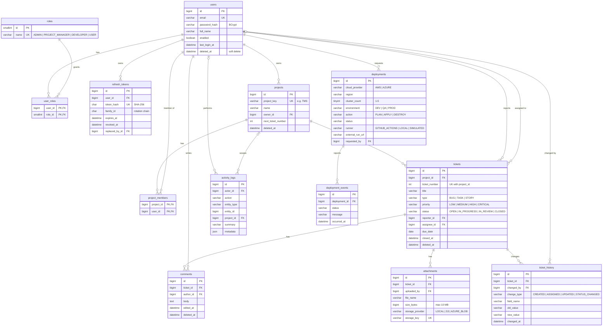

# Database design

MySQL 8.0, InnoDB, utf8mb4, all timestamps UTC. Schema is owned by Flyway:

| Location | Contents | Loaded in |
|---|---|---|
| `backend/src/main/resources/db/migration` | `V1__init_schema.sql` — tables, constraints, indexes, the 4 roles | every environment |
| `backend/src/main/resources/db/demo` | `V1_1__demo_seed.sql` — 5 users, 2 projects, 11 tickets, history, comments | local / dev / QA only |

Demo logins (password `Password@123`): `admin@`, `pm@`, `dev@`, `dev2@`, `user@trackflow.dev`.

## ER diagram

Audit columns (`created_at`, `updated_at`, `created_by`, `updated_by`) and `version` are omitted below for readability; every business table has them.

## Design decisions

| Decision | Why |
|---|---|
| Ticket key = `project_key` + `ticket_number`, number allocated from `projects.next_ticket_number` under a row lock | Human-readable keys (`TMS-42`) without gaps from rolled-back inserts racing each other |
| `CHECK ((status = 'CLOSED') = (closed_at IS NOT NULL))` | Time-to-close metrics can trust `closed_at`; reopen must clear it |
| Enums as `VARCHAR` + `CHECK` instead of MySQL `ENUM` | Maps cleanly to JPA `@Enumerated(STRING)`; adding a value is a one-line migration |
| Soft delete on users / projects / tickets / comments / attachments | Keeps history, FKs and dashboards consistent; admin "delete user" deactivates |
| Audit `created_by` / `updated_by` without FKs | Audit data must survive user removal; filled by Spring Data auditing |
| Refresh tokens hashed, grouped by `family_id` | A stolen refresh token that is replayed after rotation revokes the whole family |
| Deployment `status` validated in code, request fields by `CHECK` | The step list may grow; the request parameters are fixed by the PRD |

## Indexes and the queries they serve

| Index | Query |
|---|---|
| `tickets (project_id, status)` | Project board / list filtered by status, dashboard per project |
| `tickets (assignee_id, status)` | "My tickets" for developers, productivity per assignee |
| `tickets (reporter_id, status)` | "My tickets" for USER role |
| `tickets (status, priority)`, `tickets (priority)` | Dashboard by status / priority, priority filter |
| `tickets (created_at)`, `tickets (closed_at)` | Sorting, closed-per-week and time-to-close metrics |
| `tickets (title)` | Prefix search on title |
| `ticket_history (ticket_id, changed_at)`, `comments (ticket_id, created_at)` | Ticket timeline |
| `activity_logs (project_id, created_at)`, `(actor_id, created_at)` | Activity feeds |
| `deployments (cloud_provider, region, environment)` | Deployment history filters |
